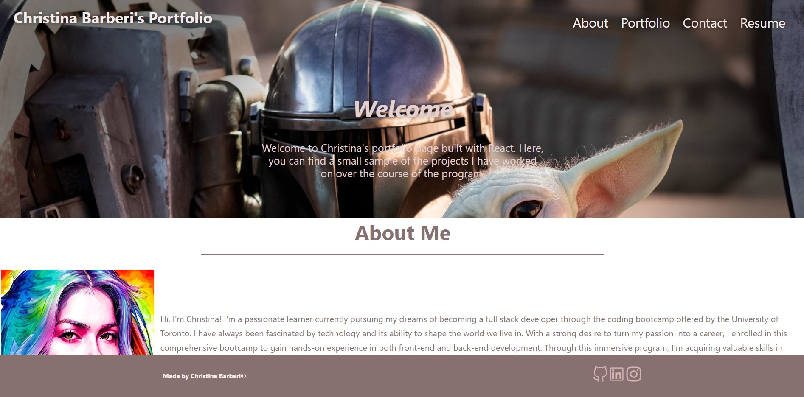

# Christinas React Portfolio

## Description

This portfolio showcases my projects and is built as a single-page application using React, React icons, HTML, CSS, and JavaScript. It serves as a platform to exhibit the projects I have been involved in!

## Table of Contents

* [Deployed Application](#deployed-application)
* [Screenshot](#screenshot)
* [License](#license)
* [Questions](#Questions)
* [Github](#Github)
* [Owner](#Owner)

## Deployed Application
Please navigate to https://christinaecb.github.io/Christinas-React-Portfolio/ in your browser to see my application!

## Screenshot:

## License

This project is licensed under the MIT license. Click [here](https://opensource.org/licenses/MIT) for more information. 

## Questions:

If you have any questions email me directly at christina.e.c.barberi@gmail.com

## Owner:

Christina Barberi

